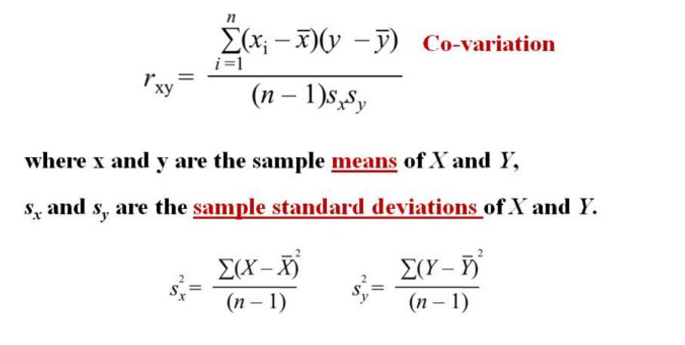
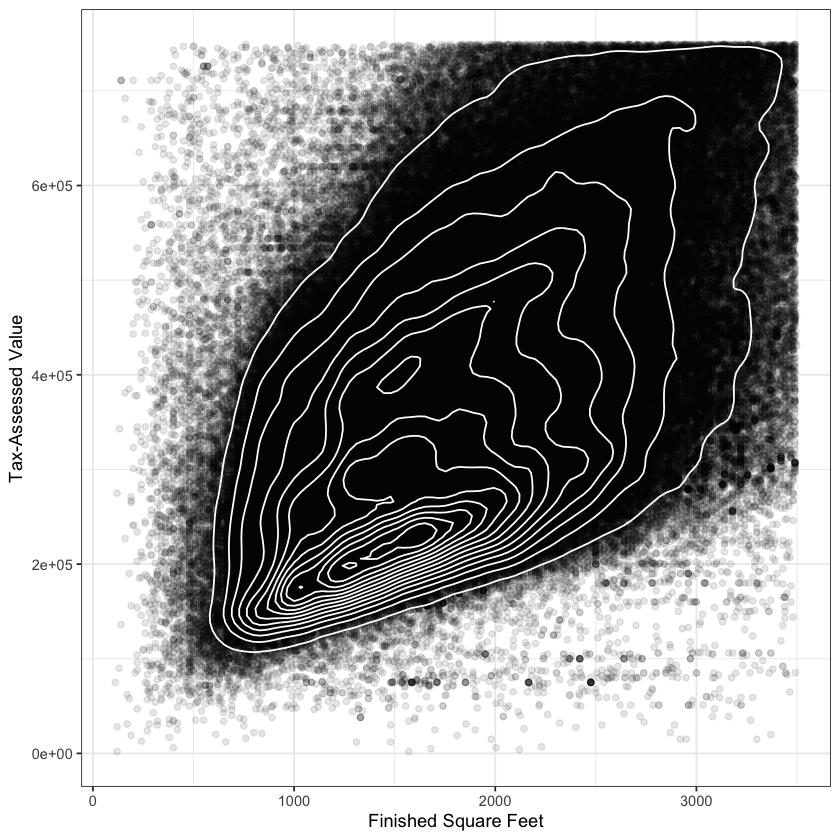
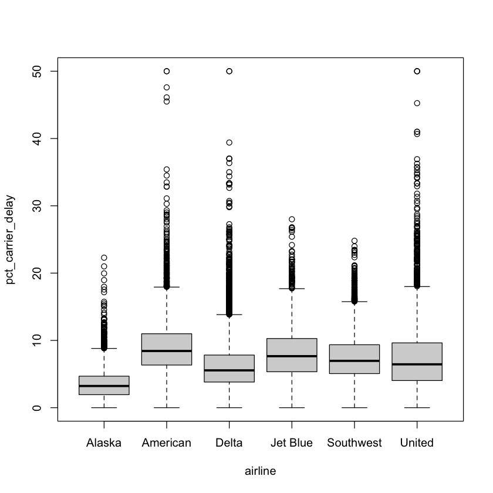

# 1. 탐색적 데이터 분석

### **정형 데이터**

- 연속형 (continuous): 일정 범위 안에서 어떤 값이든 취할 수 있는 데이터
- 이산 (discrete): 횟수와 같은 정수 값만 취할 수 있는 데이터
- 범주형 (categorical): 가능한 범주 안의 값만 취하는 데이터
    - 이진 (binary, indicator): 0, 1만 같는 범주형 데이터의 특수한 경우
    - 순서형 (ordinal): 값들 사이에 분명한 순위가 있는 범주형 데이터 (예: 평점)
        - R - ordered.factor
        - python - sklearn.preprocessing.OrdinalEncoder
- 시계열 데이터: 동일한 변수 안에 연속적인 측정값
- 공간 데이터: object(객체(주택), x, y), field(일정 공간 상에 연속적으로 분포된 특정 계량값들-기온, 수온, 압력 등)

### **위치 추정**

- 데이터를 살펴보는 가장 기초적인 단계. typical value(대푯값) 구하기
    - 백분위수 (percentile): 전체 데이터의 P%를 아래에 두는 값
    - 절사평균 (trimmed mean): 크기 순으로 정렬한 뒤, 정해진 개수의 극단값을 제외한 나머지 값들의 평균. 중간값과 평균의 절충안.
    - 가중 중간값(weighted median): 데이터 포인트 값 기준으로 데이터 포인트, 가중치를 모두 정렬한 후, 각 가중치 값을 위에서부터 더할 때, 총합의 중간이 위치하는 데이터 값
        - 예시
            1. **데이터 정렬**: 데이터를 값에 따라 오름차순으로 정렬합니다.
                - 정렬된 데이터: 1,2,3,4,5
                - 정렬된 가중치: 2,1,1,1,1
            2. **가중치 누적**: 가중치의 누적합을 계산합니다.
                - 가중치 누적합: 2,3,4,5,6
            3. **중간 가중치 위치 찾기**: 전체 가중치의 합(6)의 절반인 3을 기준으로 누적 가중치에서 이 값을 넘기지 않는 첫 번째 위치를 찾습니다.
                - 가중치 누적합이 3을 초과하지 않는 첫 번째 데이터는 2입니다.
                    
                    → 따라서, 이 예시에서 가중 중간값은 2입니다.
                    
    - 중간값은 평균보다 특잇값에 로버스트하다

c.f estimate (추정값): 데이터로부터 계산된 값들 ↔ 실제 상태를 나타내는 이론적인 참값 

- DS에서는 metric (측정 지표)fkrh qnfmsek

c.f. 통계학에서 대문자는 모집단을 의미 

- 📌 가중 평균을 사용하는 두 가지 이유
    - 어떤 값들이 다른 값들에 비해 큰 변화량을 가질 때 → 이런 관측값에 대해 더 작은 가중치 부여
        - 예) 여러 센서에서 가져온 데이터 평균을 구한다고 할 때, 한 센서의 정확도가 떨어진다면 그 센서에서 나온 데이터에는 낮은 가중치를 주는 것이 합리적
    - 서로 다른 대조군에 대해 같은 비율을 반영하는 데이터를 수집하기 어려움 → 소수 그룹에 더 높은 가중치를 적용함
        - 예) 미국 전체의 평균 살인율 계산 → 주마다 다른 인구 고려해야 하기 때문에 가중 평균 사용

c.f. anomaly detection (이상 검출) : outlier를 찾아내는 것 

### **변이(variability) 추정**

- 데이터의 특징을 요약하는 또 다른 요소
- 산포도(dispersion): 데이터 값이 얼마나 밀집해 있는지 퍼져 있는지
- 변이를 측정하고, 줄이고, 실제 변이와 랜덤을 구분하고, 실제 변이의 다양한 요인들을 알아보고, 변이가 있는 상황에서 결정을 내리기 등
- 용어 정리
    
    편차 (deviation): 관측값과 위치 추정값(평균, 중간값 등) 사이의 차이 
    
    분산 (variance): 평균과의 편차를 제곱한 값들을 n-1로 나눈 값. (n: 데이터 개수)
    
    표준편차 (standard deviation): 분산의 제곱근
    
    평균절대편차 (mean absolute deviation): 평균과의 편차(차이)의 절댓값의 평균
    
    MAD (Median Absolute Deviation from the median): 중간값의 중위절대편차. 중간값과의 편차의 절댓값의 중간값 
    
    순서 통계량 (order statistics): 최소에서 최대까지 정렬된 데이터 값에 따른 계량형 
    
    백분위수 (percentiles): 어떤 값들의 P 퍼센트가 이 값 혹은 더 작은 값을 갖고, (100-P) 퍼센트가 이 값 혹은 더 큰 값을 갖도록 하는 값 
    
    사분위범위 (IQR: interquartile range): 75번째 백분위수와 25번째 백분위수 사이의 차이 
    
- 표준편차와 관련 추정값들
    - 편차들의 대푯값 추정
        - 편차 자체의 평균은 부적합-음의 편차, 양의 편차가 서로 상쇄할 수 있어서 (평균을 기준으로편차의 합은 항상 0)
    - 통계학에서 표준편차를 평균절대편차보다 더 선호하는 이유
        - 수학적으로 제곱한 값이 절댓값보다 통계 모델을 다루는 데 더 편리하기 때문
    - 왜 분산 구할 때 n이 아닌 n-1로 나누는가?
        - 표본을 가지고 모집단을 추정하는 상황
        - n으로 나누면 모집단의 분산과 표준편차의 참값을 과소평가하게 됨 → biased 추정 ↔ n-1로 나눠야 unbiased 추정
            - 자유도: 추정값을 계산할 때 제약 조건의 개수를 의미
            - 표준편차는 표본의 평균에 따른다는 하나의 제약 조건을 가지고 있기 때문에 n-1의 자유도를 갖는다 (추가 설명 펼치기)
                - 예를 들어, 10개의 데이터 포인트로부터 표본 평균을 계산하고 이를 사용하여 각 데이터 포인트의 평균으로부터의 편차를 계산할 때, 첫 9개의 데이터 포인트는 자유롭게 값을 취할 수 있지만, 마지막 10번째 데이터는 이미 앞의 9개의 값과 평균 값으로 인해 그 값이 결정됩니다. 즉, 마지막 데이터 포인트의 값은 자유롭게 결정될 수 없습니다.
                - 따라서, *n*개의 데이터에서 자유롭게 값을 취할 수 있는 데이터 포인트의 수는 n−1개가 됩니다. 이러한 이유로 표본 분산을 계산할 때는 n−1로 나누어서 계산합니다. 이를 '분모에서 자유도를 n−1로 사용한다'고 표현하며, 이 방식을 사용함으로써 편향되지 않은(unbiased) 추정치를 얻을 수 있습니다.
    - MAD (중간값의 중위절대편차): 로버스트한 변이 추정값
        - 분산, 표준편차, 평균절대편차 모두 특잇값과 극단값에 로버스트 하지 않음
            - 분산, 표준편차는 특히 제곱이 들어가서 특잇값에 민감
    
    c.f. 분산, 표준편차, 평균절대편차, 중위절대편차 모두 데이터가 정규분포에서 왔다고 가정 
    
    - 표준편차는 항상 평균절대편차보다 크다
    - 평균절대편차는 중위절대편차보다 크다
        - 중위절대편차에 scaling factor(1.4826)을 곱하면 정규분포 경우에 표준편차와 같은 척도에서 MAD를 사용할 수 있다
- 백분위수에 기초한 추정
    - 정렬된 데이터가 얼마나 퍼져있는지 보는 것 → 특잇값에 민감한 것을 피하기 위해 범위의 양 끝에서 값들을 지운 후, 범위를 다시 알아보기
    - P번째 백분위 수
        - 그 값보다 작거나 같은 값이 전체의 P 퍼센트
        - 그 값보다 크거나 같은 값이 전체의 100 - P 퍼센트
        - 백분위수는 분수 형태로 나타낸 분위수(quantile)과 근본적으로 같은 것
            - 0.8분위수 = 80번째 백분위수
    - 사분위범위(IQR)
        - 25번째 백분위수와 75번째 백분위수의 차이를 보는 것
        - 예: [3, 1, 5, 3, 6, 7, 2, 9] → 정렬 → [1, 2, 3, 3, 5, 6, 7, 9]
            - 🚨주의: 백분위수 계산할 때 n+1을 곱해준다. 왜냐면 n개의 숫자로 n+1의 구간이 생기기 때문
                
                
                
            - 8개 → 9개 구간 → 9 *0.25 = 2.25 → 두번째와 세번째 숫자로 선형 보간해서 구한다
            - P = (1-w) * x(j) + w*x(j+1)
                
                → R에서 quantile 함수의 경우 w를 선택하는 방식이 9가지로 다양. 기본은 7번째라고 함. 
                
            - 그래서 2.5가 될 수도 있고, 2.75가 될 수도 있음
            - 책의 공식을 따르면(n 그대로 사용)
                - 100 * j / 8 ≤ 25 < 100 * (j+1) / 8 → j ≤ 25 * 8 / 100 = 2 < j+1 ⇒ 1 < j ≤ 2
                - 식을 만족하는 정수는 2가 유일 → P = (1-w) * x(j) + w*x(j+1) 식에서 두번째 x와 세번째 x가 쓰임을 알 수 있다. j+1 = 3!
        
        <aside>
        📌 분산, 표준편차가 가장 보편적으로 사용되는 변이 측정 방법이지만, 특잇값에 민감하다
        → 중간값과 백분위수로부터 평균절대편차와 중간값의 중위절대편차를 구하는 것이 더 로버스트 하다
        
        </aside>
        

### **데이터 분포 탐색하기**

- 상자 그림
- 도수분포표 (frequency table) : 어떤 구간 (interval = bin)에 해당하는 수치 데이터 값들의 빈도를 나타내는 기록
- 히스토그램: x축(구간), y축(빈도)를 나타내는 도수 테이블의 그림
- 밀도 그림 (density plot): 히스토그램을 부드러운 곡선으로 나타낸 그림. 커널 밀도 추정(kernel density estimation 사용)
1. 백분위수와 상자 그림 
    - 백분위수는 분포의 꼬리 부분을 묘사하는데 적합 (예- 상위 1%)
    - ✅ 상자 그림 해석 예
        
        
        
        1. 주별 중간값이 5 million (초록선)
        2. 주 절반이 약 2~7 million (박스)
            - 상자 위,아래가 75%, 25% 백분위수 나타냄 → 상자 폭이 50%가 위치한 범위 가리킴 (IQR, 사분위범위)
            - 어디에 얼마나 쏠려 있는지는 알 수 없음
        3. 상자 위아래에서 뻗어나가는 수직선: whisker 
            - 데이터 전체의 범위를 나타내주는 위아래선과 연결
            - 아랫 whisker: 25% 백분위수(상자 밑변)에서 1.5 * 상자 길이(IQR) 밑으로 더 내려가지 않도록 한다
            - 윗 whisker: 75% 백분위수(상자 윗변)에서 1.5 * 상자 길이(IQR) 위로 더 올라가지 않도록 한다
            - 아랫 수염이 윗수염보다 짧다: 25% 미만에 속하는 숫자들은 좁은 범위에 조밀하게 모여 있다. outlier가 없다 ↔ 75% 초과에 해당하는 숫자들 중 혼자 튀어나가는 데이터들이 있다. 더 넓은 범위에 넓게 분포해있다
        4. 수염 부분보다 더 바깥쪽에 위치한 동그라미들은 outlier 
2. 도수 분포표와 히스토그램 
    - 변수의 범위를 동일한 크기의 구간으로 나눈 다음, 각 구간마다 몇 개의 변숫값이 존재하는지를 보여주기 위해 사용
    - 구간의 크기가 너무 크면, 분포를 나타내는 중요한 특징 놓침 ↔ 구간의 크기가 너무 작으면, 결과가 너무 쪼개져 있어서 더 큰 그림을 볼 수 없다
    - ✅ 백분위수 vs. 도수분포표
        - 백분위수: 각 구간에 같은 수의 데이터가 포함되도록, 서로 구간 크기가 다르게 나누는 것
        - 도수분포표: 구간의 크기가 같고, 구간 안에 속한 데이터 개수는 서로 다름
    - 히스토그램: 도수분포표를 시각화하는 방법
        - x: 구간, y: 구간별 데이터 개수
        - 정보 해석
            - 빈 구간이 있을 수 있다
            - 구간들은 서로 동일한 크기를 갖는다
            - 구간 수나 구간의 크기는 사용자가 결정할 수 있다
            - 빈 구간이 없으면 막대 사이는 여백 없이 서로 붙어 있다
    
    c.f. 모멘트
    
    통계학에서 위치는 일차 모멘트, 변이는 이차 모멘트. 왜도는 삼차 모멘트, 첨도는 사차 모멘트. 
    
    왜도: 데이터가 큰 값/작은 값 쪽으로 얼마나 비스듬히 쏠려 있는지
    
    첨도: 데이터가 극단 값을 갖는 경향을 나타냄 
    
3. 밀도 그림과 추정
    - 데이터의 분포를 연속된 선으로 보여줌 (부드러운 히스토그램)
    - 커널밀도추정을 통해 데이터로부터 직접 계산
    - 밀도 그림 vs. 히스토그램 차이
        - y축 단위가 다르다 - 밀도 그림은 y 축 단위가 개수가 아닌 비율
        - 밀도 곡선 아래의 총 면적은 1
        - 구간의 개수 대신 x 축 두 점 사이의 곡선 아래 면적을 계산 - 두 점 사이에 있는 분포의 비율에 해당

### 이진 데이터와 범주 데이터 탐색하기

- 범주: 전혀 다른 집합, 정도를 나타내는 요인변수의 수준(상-중-하), 구간별로 나뉜 수치 데이터 같은 것을 의미
- 범주형 데이터에서는 간단한 비율이나 퍼센트를 이용해 데이터에 관해 이야기할 수 있다
    - 이진 데이터: 1과 같이 중요한 범주의 비율이 어느 정도 되는지 알아보면 된다
- 최빈값 (mode) : 데이터에서 가장 자주 등장하는 범주(값)
- 기댓값 (expected value) : 범주에 해당하는 어떤 수치가 있을 때, 범주의 출현 확률에 따른 평균
- bar plot vs. histogram
    
    
    | bar plot | histogram |
    | --- | --- |
    | x축: 각 요인 변수의 서로 다른 범주 | x축: 수치적으로 나타낼 수 있는 하나의 변수의 값  |
    | 막대들이 서로 떨어져 있음 | 막대들은 붙어 있고, 중간에 틈은 값이 존재하지 않음을 의미  |
- 기댓값
    - 각 범주에 해당하는 수치형 변수들이 존재하는 특별한 경우
    - 가중치를 특정 범주가 발생할 확률로 삼았을 때 구한 가중 평균 = 기댓값
    - 예) 클라우드 기술 상품을 판매하는 회사가 두 가지 다른 수준의 서비스를 제공
        - 한 서비스의 이용료는 매달 30만원, 다른 하나는 매달 5만원
        - 영업 사원이 고객 명단을 확보하기 위해 무료 웨비나 진행
        - 참석자의 5%가 30만원 짜리 상품에, 15% 정도가 5만원 상품에 가입, 나머지 80%는 어느 것에도 가입하지 않을 것이라고 판단
        
        → 웨비나 참석자들의 기댓값: 30만 * 0.05  + 5만 * 0.15 + 0원 * 0.8 = 1.5만 + 0.75만 = 2.25만 = 22,500
        
    - 주로 요인변수의 수준을 요약하는 데 사용
    - 사업 평가, 자본 예산의 가장 근본적인 토대
        - 새로운 기업 인수로 얻을 수 있는 5년간의 수익에 대한 기댓값
        - 병원에서 새로운 환자들을 관리하는 소프트웨어로 얻을 수 있는 비용 절감의 기댓값
- 확률
    - 상황이 수없이 반복될 경우 사건이 발생할 비율

### 상관관계

- 예측값들 간 혹은 예측값과 목푯값 과의 상관관계 (X가 증가하면 Y도 증가하는지, 아니면 Y는 감소하는지)
- 상관계수 (correlation coefficient): 수치적 변수들 간에 어떤 관계가 있는지를 나타내기 위해 사용되는 측정량 (-1~+1 → 표준화된 측정 지표 )
- 상관행렬 (correlation matrix) : 행과 열은 변수들을 의미. 각 셀은 행,열에 해당하는 변수들 간의 상관관계 의미
    - 대각원소는 자기 자신과의 상관관계 = 항상 1
    - 대각원소 아래 쪽은 위쪽과 같은 값을 갖는 대칭 행렬
- 산점도 (scatter plot) : x축과 y 축이 서로 다른 두개의 변수를 나타내는 도표
1. 피어슨 상관계수 
    - 두 변수 사이의 상관관계를 항상 같은 척도에 놓고 추정
    - 데이터는 1~n개가 있고, x, y변수가 있는 상황에서 피어슨 상관계수 계산법
        - 공식
            
            
            
        1. x_i, y_i 각 데이터에서 bar_x, bar_y (평균)을 빼서 편차를 구한다 
        2. 두 값을 곱한다 
        3. 데이터 1~n까지 1.2. 반복해서 n개의 값을 구한 뒤 다 더한다
        4. n-1로 나눈다
            - 왜 n-1로 나누는가? [자유도와 관련](1%20%E1%84%90%E1%85%A1%E1%86%B7%E1%84%89%E1%85%A2%E1%86%A8%E1%84%8C%E1%85%A5%E1%86%A8%20%E1%84%83%E1%85%A6%E1%84%8B%E1%85%B5%E1%84%90%E1%85%A5%20%E1%84%87%E1%85%AE%E1%86%AB%E1%84%89%E1%85%A5%E1%86%A8%208b663eb9c1114a1a8c876bd78edb7105.md)
        5. x의 표준편차(s_x), y의 표준편차(s_y)를 곱한 값으로 다시 나눠준다 
        - 1이면 완전한 양의 상관관계, -1이면 완전한 음의 상관관계
    - ✅ 그러나 변수들이 선형적인 관계를 갖지 않을 경우, 상관계수는 유용한 지표가 아니다!!
        - 예) 세율과 세수입의 관계 - 세율에 0에서 점점 증가할 수록 세수입도 점점 증가. 그러나 세율이 100%에 다다를 수록 과세 회피가 늘어 세수입이 줄어들게 된다
    - ✅ 상관관계 그래프 해석 (R)
        
        
        
        - 원의 색깔: 진할 수록, 원의 너비: 얇을 수록 강한 관계성 (자기자신과의 상관관계는 한 줄 처럼 보임)
        - 타원이 오른쪽 상단으로 기울어져 있으면 양의 관계, 타원이 왼쪽 상단으로 기울어져 있으면 음의 관계
        - SPY(S&P 500)과 DIA(다우 존수 지수)의 높은 상관성 발견됨 (얇고 진하다)
        - QQQ와 XLK도 양의 상관관계 (둘다 주로 첨단 기술 회사)
        - 시장변동성(VXX)과 다른 항목들은 대체로 음의 상관관계
    - 상관관계는 데이터의 특잇값에 민감하다
        - 이를 대체하기 위한 로버스트한 방법들을 제공하는 software package 있음. R의 robust covRob 함수, sklearn.covariance
    - 스피어먼의 로, 켄들의 타우 같은 순위를 기초로 하는 상관계수도 있음
        - 값 자체보다 값의 순위를 이용 → 특잇값에 더 로버스트, 비선형 관계도 다룰 수 있음
        - 그러나 데이터가 작고 어떤 특별한 가설검정이 필요할 때 주로 사용
2. 산점도
    - 두 변수 사이의 관계를 시각화 하는 가장 기본적인 방법
    - x, y: 각각의 변수들, 그래프의 각 점: 하나의 record
    - 산점도 해석 예시
        
        
        
        - 두 수익은 0 주변에 모여 있지만, 강한 양의 상관성을 보인다
        - 1,3 사분면에 위치한 점이 많다: 자주 함께 오르고 떨어짐
        - 2,4사분면에 위치한 점이 드물다: 한 주식이 떨어질 때 다른 주식이 오르거나 반대가 되는 경우는 별로 없다

### 두 개 이상의 변수 탐색하기

- 기본적으로 분석은 요약통계를 계산하고 시각화 하는 것을 기본으로 함
- univariate analysis: 평균, 분산과 같이 한 번에 하나의 변수를 다루는 일변량 분석
- bivariate analysis: 상관 분석은 두 변수를 비교할 때 중요한 방법
- multivariate analysis: 셋 이상의 변수를 다루는 법
- 용어
    - 분할표 (contingency table): 두 가지 이상의 범주형 변수의 빈도수를 기록한 표
    - 육각형 구간 (hexagonal binning): 두 변수를 육각형 모양의 구간으로 나눈 그림
    - 등고 도표 (contour plot): 지도상에 같은 높이의 지점을 등고선으로 나타내는 것처럼, 두 변수의 ㅁ리도를 등고선으로 표시한 도표
    - violin plot: 상자 그림과 비슷하지만 밀도 추정을 함께 보여줌
- **수치형 변수 vs. 수치형 변수** 를 시각화 → hexagonal binning, contour plot
    - 데이터 개수가 많아지면 산점도의 점들이 너무 밀집되어 알아보기 어려움
    - ✅ 육각형 구간 그림 해석
        
        
        
        - 기록값을 육각형 모양의 구간들로 나누고, 각 구간에 포함된 기록값의 개수에 따라 색깔을 표시
        - Y축 과세 평가액과 X 축 집의 크기가 양의 상관관계를 갖는 것을 쉽게 파악 가능
        - 주요 그룹은 가장 어둡고 아래쪽에 있는 부분
        - 그 바로 위쪽에 또 하나의 그룹이 있는데 주요 그룹 부분과 크기는 같은 집들이지만 과세 평가액이 더 높은 경우
    - ✅ contour plot 해석
        
        
        
        - 산점도 위에 등고선 사용
            - 등고선: 두 변수로 이루어진 지형에서 밀도가 같은 점을 연결한 선
            - 꼭대기쪽으로 갈 수록 밀도가 높아진다
            - 주요 봉우리 위쪽에 두번째 봉우리가 있다
- **범주형 변수 vs. 범주형 변수**  요약 → contingency table
    - 분할표: 두 범주형 변수를 요약하는 방법. 범주 별 빈도수를 기록한 표
        - c.f. 엑셀에서 pivot table 주요 기능
            1. **데이터 집계**: 데이터를 합계, 평균, 최대값, 최소값 등으로 요약할 수 있습니다.
            2. **분류 및 필터링**: 특정 조건에 따라 데이터를 분류하거나 필터링하여 보다 특정한 분석을 가능하게 합니다.
            3. **행과 열의 재정렬**: 피벗 테이블의 레이아웃을 변경하여 다양한 차원에서 데이터를 분석할 수 있습니다.
            4. **드릴다운 기능**: 요약된 데이터를 클릭하여 더 세부적인 데이터를 볼 수 있는 기능을 제공합니다.
        
        
        
        - 테이블 읽는 법
            
            
            
            - 신용 등급 각 grade마다 두 개의 sub 행
                - N: 윗 줄은 각 대출 결과에 해당하는 일반 횟수 count
                - N / Row Total: 아랫줄은 count / 해당 grade 전체
        - pandas의 경우, 비율과 단순카운트를 별도의 테이블로 얻을 수 있다
        
- **범주형 변수 vs. 수치형 변수** 시각화 → box plot, violin plot
    - ✅ 상자 그림 해석
        - 범주형 변수: x 축, 항공사 이름 vs. 수치형변수: y축, 비행 지연 비율
        
        
        
        - 알래스카 항공의 지연이 가장 적었던 반면, 아메리칸 항공의 지연이 가장 많았다 (중간값이 가장 높음)
            - 아메리칸의 낮은 사분위수 (25%)가 알래스카의 높은 사분위수(75%)보다도 높다
    - Violin plot
        - 상자그림을 보완한 형태. y축을 따라 밀도 추정 결과를 동시에 시각화
        - 밀도 분포 모양을 좌우 대칭으로 서로 겹쳐지도록 해놓음
        - 상자 그림에서는 보이지 않는 데이터 분포를 볼 수 있음 ↔ 상자 그림에서는 특잇값이 더 잘 보인다
    - ✅ 바이올린 그래프 일반적인 해석 시
        1. **바이올린 너비**: 바이올린의 너비는 해당 위치에서의 데이터 밀도
            - 너비가 넓은 부분은 많은 데이터 포인트가 존재하는 구간, 좁은 부분은 상대적으로 데이터 포인트가 적은 구간
            - 각 y축의 특정 값에서 바이올린의 너비는 그 값이 데이터 내에서 얼마나 자주 발생하는지를 나타내는 밀도 추정 결과
        2. **꼬리**: 긴 꼬리는 데이터에 극단값이 존재할 수 있음을 나타냄
        3. **플롯의 높이**: 전체 플롯의 높이는 데이터의 범위(최소값에서 최대값)
            - ****y축은 데이터가 취할 수 있는 값
        4. 각 그래프 안에 새 개의 선
            - 1사분위수, median, 3사분위수 → 25%, 50%, 75%
    - ✅ 바이올린 도표 해석
        
        
        
        - 알래스카 항공의 경우 지연율 0퍼센트에 근방에 많은 데이터가 분포해 있음 (바이올린 너비가 넓음), 델타도 마찬가지
- **다변수** 시각화하기
    - conditioning → 두 변수 비교용 도표(산점도, 육각형 구간, 상자그림)을 더 여러 변수를 비교하는 용도로 확장해서 활용 가능
    - ✅ 예-주택 크기 vs. 과세 평가액 두 변수 비교
        - 조건화: 지리적 요인을 살피며 더 깊이 들어가보기 위해 우편번호별로 데이터를 묶어서 도식화
        
        → 98105, 98126 우편 번호에서의 평가액이 다른 두 군데 보다 훨씬 높음을 볼 수 있음 
        
        