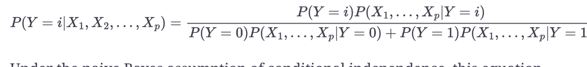
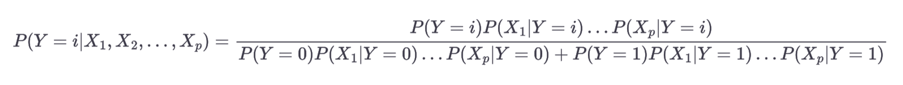

# 5. 분류

- 용어 정리
    - 조건부 확률(conditional probability): 어떤 사건(Y=i)이 주어졌을 대, 해당 사건(X=i)을 관찰할 확률. $P(X_i|Y_i)$
    - 사후확률(posterior probability): 예측 정보를 통합한 후 결과의 확률(↔ 사전확률-예측변수에 대한 정보를 고려하지 않음)

---

- 주요 개념
    - TBD

---

### 5.0 개요

- 자동으로 어떤 결정을 해야 하는 종류의 문제
    - 스팸 메일, 고객 이탈, 광고 클릭 등
- 분류
    - 지도학습의 한 형태
        - 결과를 알고 있는 데이터 → 이걸로 모델 학습 → 결과가 알려지지 않은 데이터에 모델을 적용
    - 데이터가 1/0 혹은 여러 카테고리 중 어디에 속할지 예측
        - 범주의 개수가 두 가지 이상인 경우 각 클래스에 속할 확률 예측
- 대부분의 알고리즘은 관심 클래스에 속할 확률 점수(경향, propensity)를 반환
    - R - 로지스틱 회귀 - 기본 출력: 로그 오즈 척도 → 경향 점수로 변형
    - Python - 사이킷런 - 로지스틱 회귀 - predict(클래스를 반환), `predict_proba`(각 클래스에 대한 확률을 반환)
    - 경향 점수가 나오면 컷오프(절사)를 통해 결정을 내릴 수 있음
- 일반적인 접근 방식
    1. 어떤 레코드가 속할 거라고 생각되는 관심 클래스에 대한 컷오프 확률을 정한다 
    2. 레코드가 관심 클래스에 속할 확률을 어떤 모델을 가지고 추정한다 
    3. 그 확률이 컷오프 확률이 상이면 관심 클래스에 이 레코드를 할당한다 
    - 컷오프가 높을 수록 관심 클래스에 속할 레코드 수가 감소. vice versa
- 범주 항목이 두 가지 이상이라면
    - 조건부 확률 사용해서 여러 개의 이진문제로 돌려서 생각하기
        - 예) Y = 0 vs. Y > 0 → Y > 0 이면 Y = 1 or Y = 2
    - 특히 하나의 카테고리가 다른 카테고리보다 훨씬 더 일반적인 경우

## 5.1 나이브 베이즈

- 나이브 베이즈 알고리즘
    - 주어진 결과에 대해 예측변숫값을 관찰할 확률을 사용
    - 예측변수가 주어졌을 때, 결과 Y = i를 관찰할 확률. 즉 정말 관심 있는 것을 추정
- 완전한 베이즈 분류에서 각 레코드 분류
    1. 예측변수 프로파일이 동일한(예측변수 값이 동일한) 모든 레코드들을 찾는다
    2. 해당 레코드들이 가장 많이 속한(즉, 가능성이 가장 많은) 클래스를 정한다. 
    3. 새 레코드에 해당 클래스를 지정한다. 
    - 표본에서 새로 들어온 레코드와 정확히 일치하는 데이터를 찾는 것에 무게를 두는 방식

### 5.1.1 나이브하지 않은 베이즈 분류는 왜 현실성이 없을까?

- 예측변수의 개수가 일정 정도 커지면, 분류해야 하는 데이터 대부분은 서로 완전 일치하는 경우가 거의 없다.
    - 예) 지난 선거에서 투표한, 미국 중서부 출신, 히스패닉계, 남성, 고소득자, 더 이전 선거에서는 투표 경험이 없고, 딸 셋과 아들 하나가 있으며, 현재 이혼한 상태에 있는 레코드가 새로 들어왔을 때 - 완전 일치하는 데이터가 없을 수도
- c.f. 나이브 베이즈는 베이즈 통계의 방법으로 간주되지 않음
    - 나이브 베이즈는 통계 지식이 거의 필요 없는 데이터 중심의 경험적 방법
    - 베이즈 규칙 비슷한 예측 계산이 들어가다보니 이름을 그렇게 붙였을 분
        - 결과가 주어졌을 때, 초반에 예측변수의 확률을 계산하는 부분과 결과 확률을 최종적으로 계산하는 부분이 그렇다

### 5.1.2 나이브한 해법

- 나이브 베이즈 방법에서는 확률을 계산하기 위해 정확히 일치하는 레코드로만 제한할 필요가 없다.
- 대신 전체 데이터를 활융
    1. binary response(Y=i, i=0 or i=1) 에 대해, 각 예측변수에 대한 조건부확률 P($X_j|Y=i$)를 구한다 
        - Y = i가 주어질 때, 예측변수의 값이 나올 확률
        - training set에서 Y = i인 레코드들 중 $X_j$ 값의 비율로 구할 수 있다
            - $P(X_j \cap (Y=i)) \over {P(Y=i)}$
    2. 각 확률값을 곱한 다음, Y = i 에 속한 레코드들의 비율을 곱한다
        - 각 확률값 = 각 예측변수에 대한 조건부 확률
    3. 모든 클래스에 대해 1~2단계를 반복 
        - 여기서는 binary class니까 Y=1, Y=0
    4. 2단계에서 모든 클래스에 대해 구한 확률값을 모두 더한 값으로 클래스 i의 확률을 나눈다 → 결과 i의 확률을 구할 수 있다
        - 분자: 클래스 i에 대한 2단계 값
        - 분모: 클래스 0에 대한 2단계 값 + 클래스 1에 대한 2단계 값
    5. 이 예측변수에 대해 가장 높은 확률을 갖는 클래스를 해당 레코드에 할당한다 
- 예측변수 $X_1, ..., X_p$가 주어졌을 때의 출력 Y = i 의 확률에 대한 방정식으로 표현 가능
    - $P(Y = i | X_1, X_2, ..., X_p)$
- exact naive bayes 사용하여 클래스 확률을 계산하기 위한 공식
    
    
    
    - 위를 조건부 독립성에 대한 나이브 가정하에서 전개한 결과
        
        
        
- 나이브한 공식의 의미
    - 결과가 주어졌을 때, 예측변수 벡터의 정확한 조건부 확률이
        - 각 조건부 확률 $P(X_j | Y = i)$의 곱으로
        - 충분히 잘 추정할 수 있다는 단순한 가정을 기초로 하기 때문
    - $P(X_1, X_2, ..., X_p | Y=i)$  대신, $P(X_j |  Y=i)$를 추정하면서
        - $X_j$가 k ≠ j인 모든 $X_k$와 서로 독립이라고 가정한 것
