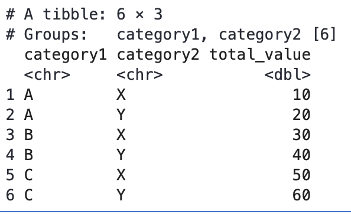

# r_tips

- data vector vs. array
    - data vector는 1차원, array는 행렬 (차원이 필요)
    
    ```r
    data_vector <- c(3, 1, 5, 3, 6, 7, 2, 9)
    dim_vector <- c(2, 2, 2)  # 이 차원은 (다 곱해서) 데이터 벡터의 길이와 일치해야 합니다.
    
    # 배열 생성
    my_array <- array(data = data_vector, dim = dim_vector)
    ```
    
    c.f. r에서는 데이터 구조가 우리가 알고 있는 데이터 타입이다 
    
    - vector, factor, matrix, dataframe, array, list
    - is.data.frame() 처럼 is. 뒤에 데이터 구조 붙여서 확인
    - 각 구조마다 object 생성 함수가 별도로 존재
    - 데이터 타입의 경우 logical, numeric, integer, complex, character, raw.
        - class() 함수로 확인
- true, false는 대문자로 써야 인식된다
- read_csv vs. as.matrix(read_csv())
    - **`read.csv()` 리턴 객체**: 'DataFrame' 객체로 반환, 각 열은 다른 데이터 유형을 가질 수 있음.
    - **`as.matrix()` 후의 객체**: 'Matrix' 객체로 변환, 모든 요소가 하나의 유형으로 통일됨.
- head(dataframe, row_num)
- 요인(Factor)과 문자열(Character)
    - **요인(Factor)**: 범주형 데이터를 표현하는 데 사용되는 데이터 유형입니다. 요인은 각 범주(카테고리)가 수준(level)으로 관리되며, 이 수준들은 내부적으로 정수로 매핑되어 저장됩니다. 이는 통계 분석에서 유용하게 사용됩니다.
        - 예) 혈액형: A, B, O, AB 나머지 문자들은 NA로 전환됨
    - **문자열(Character)**: 일반 텍스트 데이터를 저장하는 데 사용됩니다. 문자열 데이터는 텍스트 그대로 저장되며, 특정한 범주에 속하지 않습니다.
- install.package**s**()
    - 파라미터는 반드시 따옴표 안에 문자열로 넣어줘야 함
    - library()로 불러올 때는 따옴표 빼고 넣어줘야 함
- 패키지 지원 버전과 현재 R 버전이 맞지 않는 경우
    
    ```r
    R.version() # 버전, 릴리즈 시기 체크 
    install.packages("remotes")
    remotes::install_version("패키지이름", version="7.3-58")
    ```
    
    - 이런 아카이브 사이트([https://cran.r-project.org/src/contrib/Archive/MASS/](https://cran.r-project.org/src/contrib/Archive/MASS/)) 들어가서 릴리즈 시기보고 현재 R이랑 가까운 것으로 선택
    - 현재 패키지 버전 확인하기: `packageVersion("pillar")`
- ggplot 명령문이 길 경우, + 기호는 윗 줄에 붙여주고 엔터를 친 다음, 이어서 작성한다.
    - + 가 새로운 라인의 시작일 경우 에러 발생
    
    ```r
    ggplot(subset(kc_tax0, ZipCode %in% c(98188, 98105, 98108, 98126)), aes(x=SqFtTotLiving, y=TaxAssessedValue)) + 
    stat_binhex(color='white') + # 이렇게! 
    theme_bw() + 
    scale_fill_gradient(low='white', high='blue') + 
    labs(x='Finished Square Feet', y = 'Tax-assesed Value') + 
    facet_wrap('ZipCode')
    ```
    
- `rep(seq, times)`
    - 둘 다 같은 길이의 벡터로 들어올 경우, seq[i] 요소를 times[i] 만큼 반복함을 의미
- `data.frame(income=tapply(sample(loans_income, 1000*5), rep(1:1000, rep(5, 1000)), FUN=mean), type='mean_of_5')`
    - **sample(loans_income, 1000*5)**:
        - loans_income이라는 데이터 벡터에서 1000*5 (즉, 5000)개의 샘플을 무작위로 추출합니다.
        - sample 함수는 기본적으로 복원 추출을 하지 않으므로, 중복 없이 5000개의 값을 무작위로 선택합니다.
    - **rep(1:1000, rep(5, 1000))**:
        - 이 부분은 앞서 설명한 것처럼 숫자 1부터 1000까지의 각 숫자를 5번씩 반복하는 벡터를 생성합니다.
        - 결과는 c(1, 1, 1, 1, 1, 2, 2, 2, 2, 2, ..., 1000, 1000, 1000, 1000, 1000)이 됩니다.
    - **tapply(sample(loans_income, 1000*5), rep(1:1000, rep(5, 1000)), FUN=mean)**:
        - tapply 함수는 첫 번째 인수인 데이터 벡터를 두 번째 인수인 인덱스 벡터에 따라 그룹화하고, 각 그룹에 대해 지정된 함수(mean)를 적용합니다.
        - 여기서는 sample(loans_income, 1000*5)에서 추출된 5000개의 샘플 데이터를 rep(1:1000, rep(5, 1000))에 따라 1000개의 그룹으로 나누고, 각 그룹에 대해 평균을 계산합니다.
            - 예
                
                **데이터**
                
                •	샘플 데이터: c(**10, 20, 30, 40, 50**, ..., 50000)
                
                •	인덱스 벡터: c(1, 1, 1, 1, 1, 2, 2, 2, 2, 2, ..., 1000, 1000, 1000, 1000, 1000)
                
                **그룹화 및 평균 계산**
                
                각 그룹은 5개의 샘플을 포함하고, tapply 함수는 각 그룹의 평균을 계산합니다. 예를 들어:
                
                •	그룹 1: c(10, 20, 30, 40, 50) → 평균: 30
                
                •	그룹 2: c(60, 70, 80, 90, 100) → 평균: 80
                
                •	…
                
                •	그룹 1000: c(49950, 49960, 49970, 49980, 49990) → 평균: 49970
                
                ⇒ 결과는 길이가 1000인 벡터로, 각 요소는 해당 그룹의 평균 값입니다.
                
    - **data.frame(income=..., type='mean_of_5')**:
        
        •	앞서 계산된 평균 값을 income이라는 열 이름으로 갖는 데이터 프레임을 생성합니다.
        
        •	추가로 type이라는 열을 생성하고, 모든 행에 'mean_of_5'이라는 값을 할당합니다
        
- `rbind`
    - 벡터 결합
        
        ```r
        # 벡터 생성
        vec1 <- c(1, 2, 3)
        vec2 <- c(4, 5, 6)
        
        # 벡터를 행 단위로 결합
        result <- rbind(vec1, vec2)
        print(result)
        
        ```
        
        출력:
        
        ```r
             [,1] [,2] [,3]
        vec1    1    2    3
        vec2    4    5    6
        ```
        
    - 데이터 프레임 결합
        
        ```r
        # 데이터 프레임 생성
        df1 <- data.frame(A = c(1, 2), B = c(3, 4))
        df2 <- data.frame(A = c(5, 6), B = c(7, 8))
        
        # 데이터 프레임을 행 단위로 결합
        result <- rbind(df1, df2)
        print(result)
        ```
        
        출력:
        
        ```r
          A B
        1 1 3
        2 2 4
        3 5 7
        4 6 8
        
        ```
        
    - 행렬 결합
        
        ```r
        # 행렬 생성
        mat1 <- matrix(1:4, nrow=2)
        mat2 <- matrix(5:8, nrow=2)
        
        # 행렬을 행 단위로 결합
        result <- rbind(mat1, mat2)
        print(result)
        
        ```
        
        출력:
        
        ```r
             [,1] [,2]
        [1,]    1    3
        [2,]    2    4
        [3,]    5    7
        [4,]    6    8
        
        ```
        
- factor vs. text vector
    - 1.	**요약 및 통계 처리**:
        - 팩터는 summary 함수와 같은 통계 요약 함수와 함께 사용될 때 유용합니다. 각 레벨의 빈도를 쉽게 확인할 수 있습니다.
        - 텍스트 벡터는 이러한 요약을 제공하지 않습니다.
    - 2.	**메모리 효율성**:
        - 팩터는 동일한 문자열을 하나의 고유 값으로 저장하므로 메모리를 더 효율적으로 사용합니다.
        - 텍스트 벡터는 각 요소를 문자열로 저장하므로, 중복된 문자열이 많을 경우 메모리 사용이 비효율적일 수 있습니다.
    - 3.	**데이터 무결성**:
        - 팩터는 미리 정의된 레벨을 가지므로, 잘못된 값이 할당될 가능성을 줄입니다. 레벨에 포함되지 않은 값을 할당하면 경고가 발생하거나 오류가 발생합니다.
        - 텍스트 벡터는 임의의 문자열을 허용하므로 데이터 무결성이 보장되지 않을 수 있습니다.
    - 4.	**순서가 있는 데이터**:
        - 팩터는 순서가 있는 데이터(예: “저”, “중”, “고”)를 처리할 수 있습니다. ordered 인수를 사용하여 순서형 팩터를 생성할 수 있습니다.
        - 텍스트 벡터는 이러한 순서 정보를 포함하지 않습니다.
    
    `factor(income$type, levels=c('data_dist', 'mean_of_5', 'mean_of_20'), labels=c('Data', 'Mean of 5', 'Mean of 20'))`
    
    - levels의 각 값을 labels의 각 값으로 mapping
    - income&type 칼럼의 데이터 타입은 factor로 변함
- `ggplot(dataframe, aes(...)) + geom_historgram(bins=40)`
    - **aes 함수**: aesthetic 매핑을 정의하는 함수로, ggplot 함수 내에서 사용됩니다.
    - **칼럼 이름**: aes 안에는 일반적으로 ggplot의 첫 번째 인풋인 데이터 프레임의 칼럼 이름이 들어갑니다. x축, y축, 색깔, 크기 등 시각적 요소와 데이터 프레임의 칼럼을 매핑합니다.
    - 히스토그램이나 막대 그래프를 그릴 때, aes 함수에서 x축만 지정하면 y축은 자동으로 count가 됩니다.
- `facet_grid(type ~ .)`:
    - **facet_grid**: 데이터를 여러 패널로 나누어 그리는 함수입니다. 여기서는 type 열을 기준으로 행(row) 방향으로 나누어 패널을 만듭니다.
    - **type ~ .**: type 열을 기준으로 패널을 나누고, 열(column) 방향으로는 패널을 나누지 않음을 나타냅니다.
- `session_times[session_times['Page'] == 'Page A', 'Time']`
    - 행 필터링 조건, 가져오려는 열 이름
- `1:n`
    - python에서와는 다르게, n도 범위에 포함된다
- **`setdiff(x, y)`**
    - 벡터 x에서 벡터 y에 포함된 요소들을 제외한 나머지 요소들을 반환합니다.
- `abline()`
    - y = a + bx 에서 이름을 따옴
    - 그래프에 선을 추가하는 데 사용 - 직선의 방정식 또는 회귀선, 수직선, 수평선을 추가할 때 유용
    - 파라미터
        - **a**: 직선의 y절편.
        - **b**: 직선의 기울기.
        - **h**: 수평선을 추가할 y좌표.
        - **v**: 수직선을 추가할 x좌표.
        - **col**: 선의 색상.
        - **lty**: 선의 유형 (예: “solid”, “dashed”).
        - **lwd**: 선의 두께.
- `~`
    - 종속 변수와 독립 변수 간의 관계를 정의하는 표현식
    - 예) Time ~ Page : Page가 x, Time이 y
- `dimnames()`
    - R에서 배열(array)이나 행렬(matrix)의 행(row)과 열(column)의 이름을 설정하거나 가져오는 데 사용
    - 리스트를 기대하며, 리스트의 첫 번째 요소는 행 이름, 두 번째 요소는 열 이름입니다.
    - 데이터만 있던 dataframe에 행, 열 이름 부여 가능
- 패키지 함수 충돌
    
    ```
    다음의 패키지를 부착합니다: ‘lubridate’
    
    The following objects are masked from ‘package:base’:
    
        date, intersect, setdiff, union
    
    ```
    
    - lubridate라는 패키지에도 date, intersect, setdiff, union가 있다는 뜻
    - lubridate 패키지에서 해당 함수를 사용하려면 `lubridate::date()` 앞에 패키지 이름이랑 콜론 두 개 부착하면 됨
- 파이프연산자 `%>%`
    - 파이프라인을 만드는 연산자
    - 중간 결과 저장 없이 쭉 이어서 연산하게끔. 가독성 향상됨
    - 파이프연산자 쓰는 경우
        
        ```r
        lung1 <- lung %>%
        	# add new columns
          mutate(Fitted=fitted,
                 positive = PEFR > Fitted) %>% # true or false
          group_by(Exposure, positive) %>% # 두 칼럼 값 조합을 기준으로 그룹화 
          summarize(PEFR_max = max(PEFR), 
                    PEFR_min = min(PEFR),
                    Fitted = first(Fitted), 
                    .groups='keep') %>%
          ungroup() %>%
          mutate(PEFR = ifelse(positive, PEFR_max, PEFR_min)) %>%
          arrange(Exposure)
        ```
        
        - 동일한 내용인데 안 쓰는 경우
            
            ```r
            # 1. mutate 단계
            lung_mutated <- mutate(lung, Fitted = fitted, positive = PEFR > Fitted)
            
            # 2. group_by 단계
            lung_grouped <- group_by(lung_mutated, Exposure, positive)
            
            # 3. summarize 단계
            lung_summarized <- summarize(lung_grouped, 
                                         PEFR_max = max(PEFR), 
                                         PEFR_min = min(PEFR), 
                                         Fitted = first(Fitted), 
                                         .groups = 'keep')
            
            # 4. ungroup 단계
            lung1 <- ungroup(lung_summarized)
            ```
            
- dataframe: 표 형태 데이터 저장하는 객체. 행과 열로 구성
    - 각 열은 서로 다른 자료형 가능
    - 각 행과 열에 이름(label) 부착 가능
- `dpyr`: 데이터 프레임 다루는 데 유용한 함수를 포함하는 패키지
    - `mutate` : 데이터 프레임에 새로운 변수를 추가하거나 기존변수를 변형하는 데 사용
        
        ```r
        mutate(data, new_var = expression, ...)
        ```
        
        - data: 데이터 프레임 저장한 변수 이름
        - new_var: 새로 추가하거나 수정할 변수의 이름
        - expression: 새로운 변수에 할당할 값이나계산식
    - `summarize` : 그룹화된 데이터에 대해 요약 통계 계산하여 새로운 요약된 데이터 프레임을 생성
        
        ```r
        summarize(data, col_name1 = summary_expr1, .groups = ...)
        ```
        
        - data: group by를 사용하여 그룹화된 데이터
            - 보통은 data df 불러오고 → 그 다음 줄에  `group_by(그룹 키 칼럼)`  → 그리고 나서 summarize인 경우가 많음
        - col_name1: summary_expr1을 통해 계산된 내용을 col_name1 칼럼에 저장
        - summary_expr1: 요약 통계 계산을 위한 표현식들
            - `n()`: 그룹별 행의 개수 세는 데 사용
        - .groups: 요약 연산 후에도 그룹화 정보를 유지할지에 대한 선택사항
            - drop: 그룹회된 변수를 요약 연산 후 제거
            - drop_last: 마지막으로 그룹화된 변수만 제거
                - group by를 여러 칼럼으로 할 경우, 집계 함수까지 적용한 다음에, 그룹화 정보에서는 마지막 칼럼 제거하고 저장해둠
            - keep: 모든 그룹화 변수 유지
                
                
                
                - Groups:   category1, category2 [6]
                    - category1과 category2 열을 기준으로 6개의 그룹이 있다는 것을 의미
                - group_vars(result_keep)
                    - 그룹화 정보를 내부 속성으로 확인 가능
            - rowwise: 행별 연산을 유지
                - 행마다 멀리 떨어져 있는 두 칼럼에 대한 sum을 구하거나 할 때 유리
        - ungroup: 더 이상 그룹화되지 않고, 모든 행이 독립적으로 존재
            - 그룹화되었을 때 print 하면 나오던 # Groups: ... 주석이 사라짐
    - `tibble` : R의 tibble 패키지에서 제공하는 데이터 프레임의 현대적인 버전
    - `arrange` : 데이터를 지정된 칼럼 기준으로 정렬. 파라미터: 키 칼럼
    - `ntile(데이터, 구간 수)` :  데이터를 지정된 수의 구간(n-tiles)으로 나누는 데 사용
        - 데이터를 정렬한 후, 지정된 수의 구간으로 균등하게 분할
        - 예- 4개의 구간으로 나누면 각 구간은 전체 데이터의 4분의 1씩을 포함하도록 설정
        - 각 데이터 포인트는 해당하는 구간 번호를 부여받음
- `segment`: 그래픽 함수 중 하나로, 두 점을 연결하는 선분을 그리는 데 사용
    - segments(x0, y0, x1, y1, ...)
        
        ```
        •	x0: 선분의 시작점의 x좌표.
        •	y0: 선분의 시작점의 y좌표.
        •	x1: 선분의 끝점의 x좌표.
        •	y1: 선분의 끝점의 y좌표.
        •	col: 선분의 색상.
        •	lty: 선분의 선 종류(예: 실선, 점선 등).
        ```
        
- `MASS` 패키지
    - stepAIC라는 단계적 회귀 함수 제공
    - `stepAIC(house_full, direction = 'both')`
        - house_full: 초기 모델입니다. 예를 들어, 모든 독립 변수를 포함한 전체 회귀 모델
        - direction = 'both': 변수 선택의 방향을 지정. 여기서 ‘both’는 변수의 추가와 제거를 모두 허용하여 전진 선택(Forward Selection)과 후진 제거(Backward Elimination)를 동시에 수행합니다.
            - 또 다른 옵션은 forward,backward
        - trace: 변수 선택 과정을 출력할지 여부를 지정. TRUE로 설정하면 각 단계에서 선택된 변수와 AIC 값을 출력(true가 default인듯?)
        - 함수 동작 원리
            
            1.	**초기 모델 설정**: 주어진 초기 모델로 시작합니다.
            
            2.	**모델 평가**: AIC 값을 계산하여 현재 모델의 성능을 평가합니다.
            
            3.	**변수 추가/제거**: 방향에 따라 변수를 추가하거나 제거합니다.
            
            4.	**AIC 비교**: 새로운 모델의 AIC 값을 기존 모델의 AIC 값과 비교합니다.
            
            5.	**최적 모델 선택**: AIC 값이 더 낮아지면 새로운 모델을 채택하고, 그렇지 않으면 변수를 다시 선택합니다.
            
            6.	**과정 반복**: AIC 값이 더 이상 개선되지 않을 때까지 이 과정을 반복합니다.
            
- `model.matrix`
    - df 객체를 선형 모형에 적합한 행렬 형태로 변환
    - 범주형 변수 PropertyType가 “House”, “Apartment”, “Condo” 세 가지 레벨을 가진다면, 기본적으로 포함되는 모델
        
        $y = \beta_0 + \beta_1 \cdot \text{PropertyTypeHouse} + \beta_2 \cdot \text{PropertyTypeApartment} + \beta_3 \cdot \text{PropertyTypeCondo}$
        
        - $\beta_0$이 절편(인터셉트) 항
    - `~PropertyType` 만 넣어주면
        - 자동으로 House가 기준 범주(reference category)로 선택되고 모델이 아래와 같이 재구성
            
            $y = \beta_0 + \beta_1 \cdot \text{PropertyTypeApartment} + \beta_2 \cdot \text{PropertyTypeCondo}$
            
            - $\beta_0$ 존재하지만 House에 대한 계수는 0이 됨
                - $\beta_1, \beta_2$가 모두 0일 때 house의 가격
            - 기준 범주가 포함된 모델의 해석
                - $\beta_0$: House의 평균 값
                    - Apartment도 아니고 Condo도 아닐 때 집의 평균값
                    - 이 값이 0이 아니라고 해서 범주가 중복(House이면서 Condo라거나)되는 게 아님. 출발점 가격을 의미
                - $\beta_1$: Apartment와 House의 차이를 나타내는 계수
                    - ❗️헷갈렸던 점: $\beta_1$이 1이면 House이면서 Apartment일 때의 값을 의미하는 건가?
                        - 아니다. 아파트가 더 비싸면 $\beta_1$이 양수라서 House 가격에 얼마가 더 해지게 되고, 아파트가 더 싼 경향이 있으면 $\beta_1$가 음수라서 House 가격으로부터 얼마가 빼지게 된다.
                - $\beta_2$: Condo와 House의 차이를 나타내는 계수
    - `~PropertyType -1` 로 넣어주면
        - 인터셉트 항은 없어지고 모든 범주의 절대적인 값 비교 가능
            
            $y = \beta_1 \cdot \text{PropertyTypeHouse} + \beta_2 \cdot \text{PropertyTypeApartment} + \beta_3 \cdot \text{PropertyTypeCondo}$
            
- `select(df, col1, col2, ...)` : 데이터 프레임에서 특정 칼럼 선택
- `update`
    - 기존 모델을 기반으로 새로운 모델을 업데이트하거나 수정
    - . ~ .
        - 공식의 왼쪽 .  : 종속 변수(또는 반응 변수). 기존 모델의 종속 변수를 그대로 사용
        - 공식의 오른쪽 . : 독립 변수(또는 설명 변수)를 나타내며, 기존 모델의 독립 변수를 그대로 사용
- `order`
    - 주어진 벡터를 오름차순으로 **정렬된 인덱스를 반환**
    - 내림차순으로 정렬하고 싶으면 `order(x, decreasing = TRUE)`
- `resid(model)`
    - 실제 관측된 값 - 모델 추정치
    - 실제 관측된 값 개수만큼 나옴
- `subset(data, condition, select = columns)`
    - condition에 주는 조건 기반으로 데이터의 부분 집합 선택
    - select: 데이터프레임에서 어떤 칼럼을 선택할 것인지
- `plot(...)`
    - `cex` : Character Expansion, 플롯의 텍스트와 점(symbols)의 크기를 조정하는 데 사용. 기본값은 1이며, 이 값을 증가시키면 크기가 커지고, 감소시키면 작아짐
        - 특정 값 뿐만 아니라 동적으로 줄 수도 있음. 어떤 데이터 값이 커지면 이 점 크기도 커지게
    - `pch` : Plotting Character. 0에서 25까지의 정수 값을 취하며, 각 값은 다른 점 모양
    - c.f. plot 위에 산점도, 수평선 등 추가 요소 얹을 때 주의할 점
        - 같은 셀에 넣고 한번에 실행해야 함
        - 다른 셀에 나눠서 실행하면, 각각의 셀이 독립적으로 그래프를 그리게 됩니다. 따라서 플롯을 업데이트하지 않고 새로운 그래프를 그리게 됨
        - R에서는 plot 함수가 호출될 때마다 새로운 플롯 창이 열림
    - abline
        - a(기울기), b(절편), h(수평선), v(수직선), lty(line type)
        - 예제
            - h=c(-2.5, 2.5)
                - 두 점을 잇는 수평선이 아니고, 각각의 값을 지나는 수평선 두개를 추가하겠다는 것
- `ggplot(...)`
    - aes() : aesthetic mapping. x축과 y축에 사용할 변수를 지정
    - + geom_point() : 산점도 그리는 함수
    - + geom_smooth() : 데이터 추세선 그리는 함수
- `predict(...)`
    - 파라미터
        - 모델(필수) - 보통 lm 함수로 생성된 선형 회귀 모델 객체
        - 새로 추정치를 얻을 데이터(newdata)
            - 따로 안들어오면 모델을 적합시킬 때 사용된 데이터에 대해 예측을 수행
            - 모델을 적합시킬 때 사용된 독립 변수 값들을 그대로 사용하여 예측값을 반환
        - type
            - 예측 결과의 유형을 지정
                - "response": 기본값으로, 모델의 예측값을 반환
                - "terms": 각 설명 변수의 기여도를 반환
                - "link": 일반화된 선형 모델에서 링크 함수의 예측값을 반환