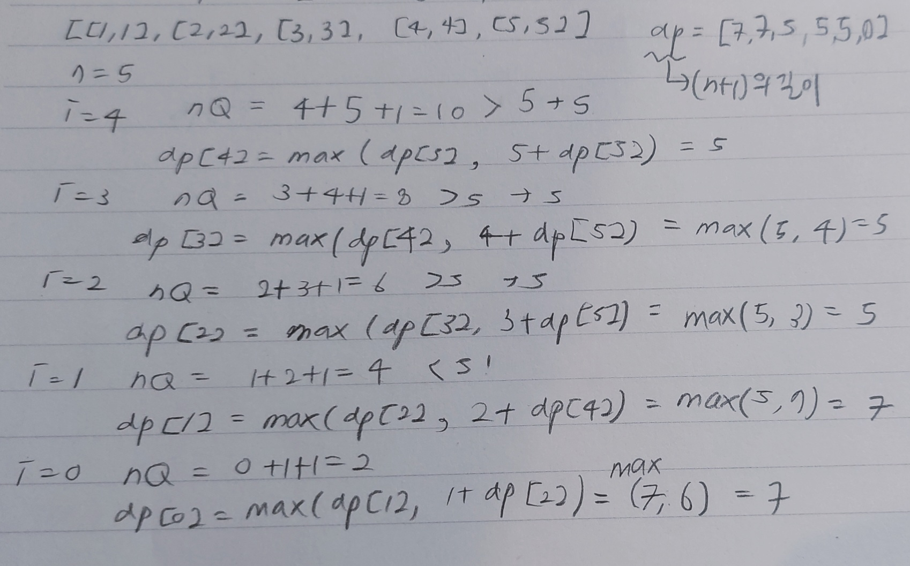

# 2140. Solving Questions With Brainpower

Status: done, in progress
Theme: DP
Created time: November 21, 2023 11:18 AM
Last edited time: November 22, 2023 1:50 PM

- [x]  다시 풀어보기
- 문제 이해
    
    Solving question `i` will **earn** you `points_i` points but you will be **unable** to solve each of the next `brainpower_i`questions. If you skip question `i`, you get to make the decision on the next question.
    
    - For example, given `questions = [[3, 2], [4, 3], [4, 4], [2, 5]]`:
        - If question `0` is solved, you will earn `3` points but you will be unable to solve questions `1`and `2`.
    - the next `brainpower_i`questions → 그 다음 question[i][1] 개 만큼 못 푼다
- 풀어보기
    
    
    
- 남의 코드
    
    ```python
    def mostPoints(self, questions: List[List[int]]) -> int:
        n = len(questions)
        dp = [0] * (n+1)
        for i in range(n-1, -1, -1):
            point, jump = questions[i] 
            nextQuestion = min(n, i+jump+1)
            dp[i] = max(dp[i+1], point + dp[nextQuestion])
        return dp[0]
    ```
    
- 시행착오
    
    ```python
    class Solution:
        def mostPoints(self, questions: List[List[int]]) -> int:
            dp = [0] * len(questions)
            dp[0] = questions[0][0]
    
            for i in range(1, len(questions)):
                formal_max = 0
                for j in range(i):
                    if j + questions[j][1] < i:
                        formal_max = max(formal_max, questions[j][0])
                dp[i] = max(dp[i-1], formal_max+questions[i][0])
            return dp[-1]
    ```
    
    같은 point이면 점프 거리가 짧은게좋음
    
    근데 이렇게 풀면 매번 자기 앞에 있는 애들을 다 봐야해서 시간이 많이 걸림
    
    해설 보니까 오른쪽에서 왼쪽으로 줄여가는 거였음 → 근데 그럼 base case는 뭐가 되지? 
    
    코드를 개선해보자. 글고 거리는 딱히 신경 안써도 되는 듯? 
    
    default는 각 문제에 대한 점수로 생각하고, 앞에서 가능한 모든 애들을 더한다면…? 
    
    brainpower는 최소 1. 그러니까 앞에꺼 풀고 다음꺼는 무조건 못 푼다고 봐야. 
    
- 남의 해설
    
    
    
    취할 수 있는 두 가지 행동: 이번 문제를 푼다 vs. 스킵한다
    
    1. 이번 문제를 푼다 → 이번 문제를 풀고 얻은 점수를 더한다 + 다음으로 풀 수 있는 문제 idx의 자리에 가서 같은 행동을 반복
    2. 스킵한다 → 바로 다음 칸으로 이동
    
    보통 dp는 앞의 칸을 미리 채우고 그걸 나중에 다시 가져다가 쓰는데, 여기서는 dp 칸을 뒤에서부터 채우고, 더 앞에서 뒤에 것을 가져다가 사용
    
    그럼 return을 dp[0]을 하려나? 맞다
    
    