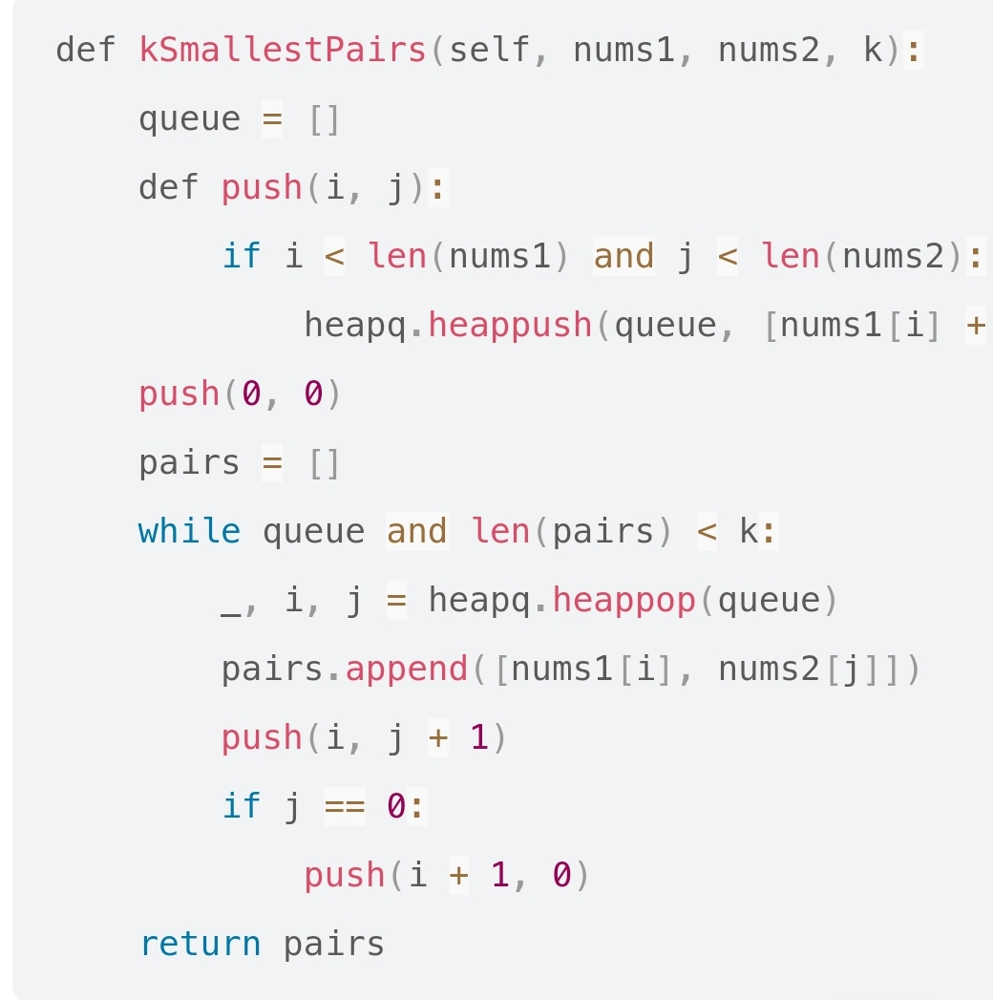
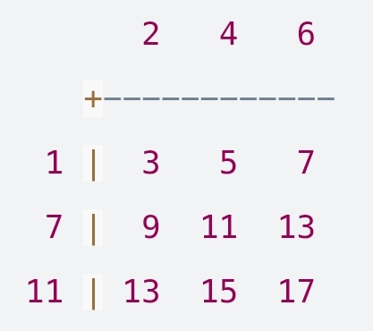

# 373. Find K Pairs with Smallest Sums

Status: done, in progress
Theme: heap
Created time: November 1, 2023 10:30 PM
Last edited time: November 2, 2023 2:56 PM

- 문제 이해
    
    합이 가장 작은 pair k개를 찾아라. 각 pair는 한 원소는 num1, 다른 한 원소는 num2에서 가져온다
    
    한 원소가 여러 pair에 대해 중복으로 사용되는 것은 가능. 다만 두 원소 모두 중복인 pair는 허용되지 않는 듯?
    
    num1, num2는 non-decreasing order: 뒤로 갈 수록 앞보다 더 크거나 같은 값들이 등장 
    
    그룹 a1 원소 + 그룹 b_n 원소 값이 a2 + b1보다 작은 한 a1은 계속 쓰일 듯 
    
- 나의 30분
    - heappop을 했던 요소를 나중에 다시 가져다 써야 할 수도
    - 아니면 모든 요소들에 대한 합이랑 pair를 저장해뒀다가 k만큼 heappop 해도 되고. 근데 효율적이진 않을텐데 우선 이렇게라도 풀어보자
        - k가 heap 길이 보다 긴 경우도 있어서 for _ in range(k) 안에 heap에 원소 남아 있는지 확인하는 조건문 달아줌
        - 근데 이렇게 하면 메모리 exceed…
    - 어떤 list를 일단 힙으로 만들고 나면, heappop으로 원소를 빼고 어쩌고 해도 늘 가장 앞에 가장 작은 값을 가진 원소가 오게 된다고 함.
- 남의 풀이
    
    
    
    
    
    - 좌상단에서 시작해서 바로 밑, 바로 옆이 가장 작을테니까 걔네부터 힙에 넣는다 → 둘 중에 더 작은 애가 먼저 나오게 될것
    - 자기 기준 오른쪽 칸을 넣고, 열이 제일 왼쪽 열이면 아래쪽 칸을 넣는다
    - 왜 애초에 오른쪽과 아래쪽을 둘다 넣지 않고 칼럼이 0일때만 아래쪽을 넣는가?
        
        1) 중간 칼럼에서 아래로 내려와 버리면, 사각지대가 생긴다-아래 행에서 중간 칼럼 가기전까지의 부분 
        
        2) 어차피 힙에서는 제일 작은 합을 pop 한다 → 그게 오른쪽이면 오른쪽으로 갈 수 있는 만큼 가면 되는 것이고, 아래쪽이면 위쪽 row의 값들은 heap에 들어 있는 상태이니 자기 차례가 되면 알아서 나올 것