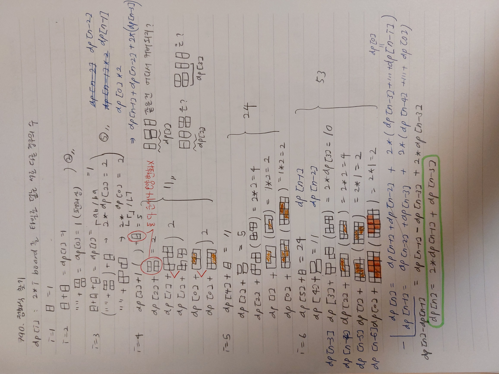

# 790. Domino and Tromino Tiling

Status: done, in progress, 🏋️‍♀️
Theme: DP
Created time: November 22, 2023 2:03 PM
Last edited time: November 22, 2023 5:13 PM

- 문제 이해
    
    In a tiling, every square must be covered by a tile. 
    
    Two tilings are different if and only if 
    
    there are two 4-directionally adjacent cells on the board 
    
    such that exactly one of the tilings has both squares occupied by a tile.
    
    → There can be adjacent pairs of cells occupied by the same tiles for two different tilings. But there must exist one which is different. Not all of them have to be different. 모두 같아야 같은 배치이고 하나라도 다르면 서로 다른 배치 방법이다 
    
- 과정
    
    ```python
    class Solution:
        def numTilings(self, n: int) -> int:
            if n == 1 : return 1 
            mod = 10**9 + 7
            dp = [0] * (n+1) # dp[i]: ways of tiling an 2*i board
            dp[1] = 1
            dp[2] = 2
    
            for i in range(3, n+1):
                dp[i] += dp[i-2]+dp[2]
                dp[i] += dp[i-1]+dp[1]
            print(dp)
            return dp[-1] % mod
    ```
    
- 남의 풀이 직접해보기
    
    
    
- 코드
    
    ```python
    class Solution:
        def numTilings(self, n: int) -> int:
            if n == 1 : return 1 
            if n == 2 : return 2
    
            mod = 10**9 + 7
            dp = [0] * (n+1) # dp[i]: ways of tiling an 2*i board
            dp[0] = 1
            dp[1] = 1
            dp[2] = 2
            dp[3] = 5
    
            for i in range(4, n+1):
                dp[i] = 2*(dp[i-1]) + dp[i-3]
            return dp[-1] % mod
    ```