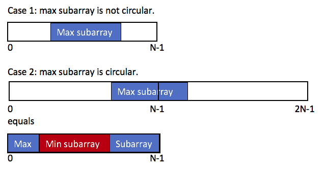

# 918. Maximum Sum Circular Subarray

Status: done, in progress, incomplete
Theme: DP
Created time: November 17, 2023 2:28 PM
Last edited time: November 17, 2023 4:19 PM

- 문제 이해
    - Formally, for a subarray `nums[i], nums[i + 1], ..., nums[j]`, there does not exist `i <= k1`, `k2 <= j` with `k1 % n == k2 % n`.
        - `k1 % n == k2 % n`
            - k1, k2를 n으로 나눈 나머지가 같다 → k1부터 시작해서 한 바퀴 돌고 k2가 나온다
            - 예) n = 3, k1 = 8 → k1 % n = 2
                
                8, 9, 10, 11 (8+3) → k2=11 → k2%n=2
                
        - 따라서 subarray 원소 개수는 n보다 작다
    - A **circular array** means the end of the array connects to the beginning of the array. Formally, the next element of `nums[i]` is `nums[(i + 1) % n]` and the previous element of `nums[i]` is `nums[(i - 1 + n) % n]`.
        - 구현은 안되어 있지만 개념적으로 n개 뒤의 원소를 가져올 수 있다고 생각되는 array
        - **Rule for Subarrays**: The phrase "a subarray may only include each element of the fixed buffer nums at most once" means that when you form a subarray from this array, any specific element from **`nums`** should not appear more than once in that subarray.
- 과정
    - 그냥 풀면 안되나?
        - 그냥 풀면 ‘[5,-3,5]’ 같은 경우가 7이 나와 버림. 10이 아니고.
    - min subarray는 kadane으로 어떻게 풀지?
        - 각 원소를 반대 부호로 설정한 다음 kadane으로 풀면 최대 subarray가 나오고 다시 그것의 부호를 반대로 하면 되려나? 되는 것 같다
            
            ```python
            >>> nums2 = [-n for n in nums]
            >>> nums2
            [-11, -1, 17, -2, 15, -9, -13]
            >>> nums
            [11, 1, -17, 2, -15, 9, 13]
            >>> kadane(nums2)
            30
            ```
            
- [ ]  좋은 문제라 나중에 한번 더 풀어보기
- 코드
    
    ```python
    class Solution:
        def maxSubarraySumCircular(self, nums: List[int]) -> int:
            if max(nums) < 0: return max(nums) # corner case 
            def kadane(arr):
                max_so_far, max_ending_here = -float('inf'), 0
                for n in arr:
                    max_ending_here = max(n, n+max_ending_here)
                    max_so_far = max(max_so_far, max_ending_here)
                return max_so_far 
            no_circular = kadane(nums)
            with_circular = sum(nums)+kadane([-n for n in nums])
            return max(no_circular, with_circular)
    ```
    
- 무지성 해설 번역
    
    
    
    subarray는 contiguous다!! → contiguous가 발생할 수 있는 경우는 크게 두 가지임 
    
    1) 주어진 array 중간에 위치 → 그냥 카데인 알고리즘 사용하면 됨 
    
    2) 순환까지 고려했을 때 원래 array의 경계를 걸쳐서 포함하는 경우
    
    - 원래 array의 머리 부분 + 꼬리 부분  그냥 그림만 봐도 말이 되지만 식으로 증명하면
        - max(prefix + suffix) = max(total_sum -subarray)
            
            = total_sum + max(-subarray)
            
            = total_sum - min(subarray)
            
    - (2n-1) % n = (n+(n-1)%n = n-1
        - n = 3 → 2n-1 = 5 → 5 % 3 = 2 = 3-1
    - 0~(N-1) == N~N+(N-1)
        - nums[n-1]의 next element: nums[(n-1+1)%n] = nums[n%n] = nums[0] ⇒ nums[n] = nums[0]
    
    ⇒ min(subarray)를 찾아라 
    
    ++ 코너케이스 ++
    
    nums가 음수로만 이루어져있으면, max_so_far = max(nums), min_so_far = sum(nums)
    
    → 순환하는 경우의 계산을 따르면 total_sim - min_so_far = 0 → empty subarray → 문제에서 요구하는 바와 맞지 않음 → max_so_far을 return 해야 함